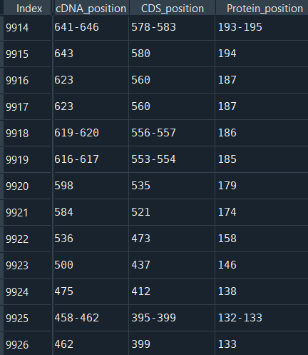
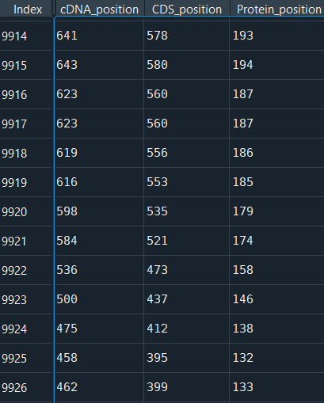
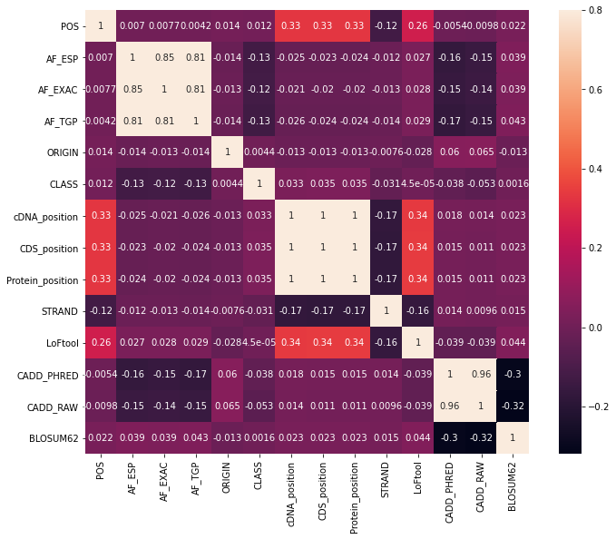
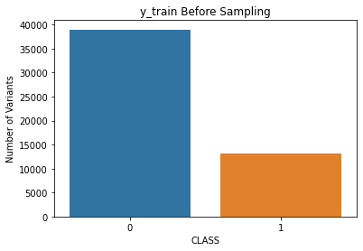
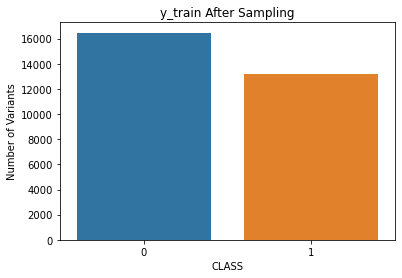

# Genetic Variant Classification

<h4 align="center">Abstract</h4>

In this project, we’ll build Machine Learning algorithms to predict whether a given variant has conflicting classification or not based on the dataset obtained from Kaggle. During this project we’ll commonly use scikit-learn library from Python. While applying Machine Learning Algorithms we’ll build four different algorithms such as: Gradient Boost, Logistic Regression, Decision Tree, and Random Forest classifiers.

## Introduction
The main purpose of this project is predicting given human genetic variant have conflicting classification or not based on Machine Learning classification algorithms. Variants that have con- flicting classifications (from laboratory to laboratory) can confuse when clinicians or researchers try to interpret whether the variant impacts the disease of a given patient. If we gain a good classification algorithm at the end of this project, we would like to help clinicians detect the variants classification

Necessary information and the data itself can be achieved from: [kaggle](https://www.kaggle.com/kevinarvai/clinvar-conflicting).

## Preprocessing Steps

The data has 65188 rows and 48 columns.

### Clean Fully NaN Features

First of all, there were 10 columns which has %99.9 NaN values. These columns have cleaned from the dataset.

### Convert Into Float

In cDNA position, CDS position, Protein position values are integer but type of features are Object. Because there are some approximation such as 1331-1332 for relative positions. We took the valid(first or second) one because they are already so close to each others.

We can see the changes below.

Before preprocessing       |  After preprocessing
:-------------------------:|:-------------------------:
  |  

###	CHROM Feature

CHROM represented for chromosome the variant has located on, and we have 22 + 2 chromosome in the dataset. The first 22 chromosomes are represented from 1 to 22, and the other two chromosomes are Y and Mitochondrial Chromosome. These two are represented as Y and MT. These two chromosomes have converted into 23 and 24.

###	Highly Correlated Features

First, correlation matrix has been plotted and the correlation between features analyzed. After analyzing correlation matrix we clearly see that ’cDNA position’, ’CDS position’,’Protein position’ features has 1 correlation between them. We can drop two of them and use just cDNA position because it has fewer NaN values than others.

###	EXON and INTRON

These two columns represent the exon and intron number out of the total number. These values are kept as i.e. 10/12. These values are converted into float numbers and kept as float.

The other issue for these features were NaN values. For EXON  and  INTRON,  their  NaN ratios are parallel. The percentage of NaN values for INTRON is %86.4, and the percentage of NaN values for EXON is %13.6. Therefore the NaN values of EXON with filled with the corresponding values of INTRON.

### Zero Varience

In the dataset, two columns have zero variance(all variables are unique). These two columns are CLNHGVS, and CLNVI with the Object type. In the CLNVI feature, there are 27659 non-null variables and 27655 unique values. In the CLNHGVS feature, there are 65188 unique values out of 65188. These two columns dropped from the dataset.

###	Similar Features

ALT(Alternate allele) and Allele are referring to the same alleles in the human genetic. Therefore we can drop the Allele column because it has some NaN values, but ALT doesn’t.

MC feature is the comma-separated list of molecular Consequence in the form of Sequence Ontology, and Consequence feature is the type of molecular Consequence. Therefore, we will keep the type of molecular Sequence and drop the MC feature.

CLNDISDB feature is the tag-value pairs of disease database name and identifier, and CLNDN feature is the disease name for the identifier. Therefore we will keep the disease name and drop the CLNDISDB. At the same time, in the CLNDN column, both not provided and not specified values are referring the same meaning. Both values were kept as not specified. For last, the CLNDN column has been kept as a binary column. Whether tag-value pairs have a disease or not. If it has a disease, assign 1, else 0.

### Dealing With Missing Values

#### Missing Because not Exist
cDNA can be described as DNA without all the necessary noncoding regions. That is means if there is no EXON, we cannot talk about the cDNA position. There is an exception. In the lack of EXON and INTRON, we may have a cDNA position. Therefore we will fill the NaN values in cDNA position as -1. That will refer to there is no such position.

CADD is a tool for scoring the deleteriousness of single nucleotide variants and insertion/deletion variants in the human genome. All the NaN values in CADD PHRED and CADD RAW belong to non-single nucleotide variants. That is means there is no CADD information for non-single nucleotide variants. We will fill the values with -1.

In the dataset, AminoAcids and Codons are only given if the variant affects protein-coding sequence. Therefore, NaN values in AminoAcids and Codons columns filled with not-affect.

#### Nominal Missing Values

There is only one case for the Nominal Missing Values and that is for **LoFtool**. Missing values in LoFtool column filled with the mean by using sklearn impute library.

##	Imbalanced Classification

We can clerly see that our target class is imbalanced. Before fit our training dataset we used a sampling algorithm called **Under Sampling**. We can observe the changes in the target class before and after the undersampling.

*Before Sampling*            |  *After Sampling*
:-------------------------:|:-------------------------:
  |  

